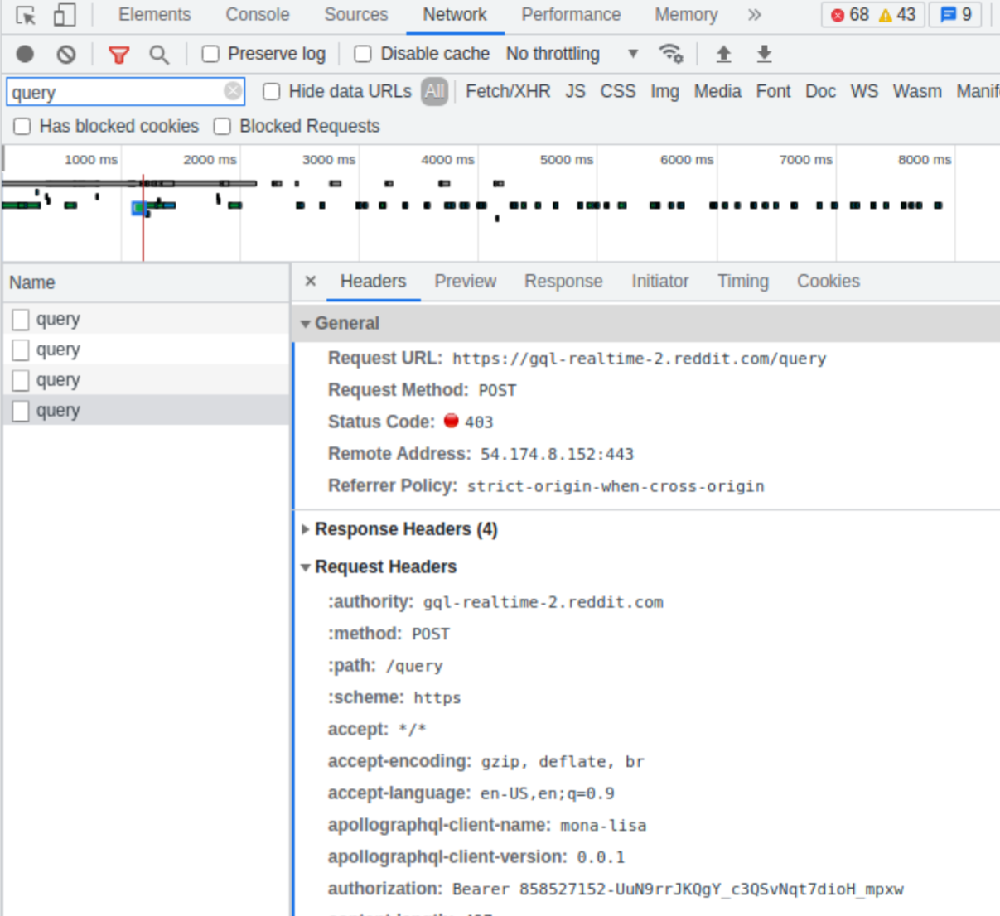
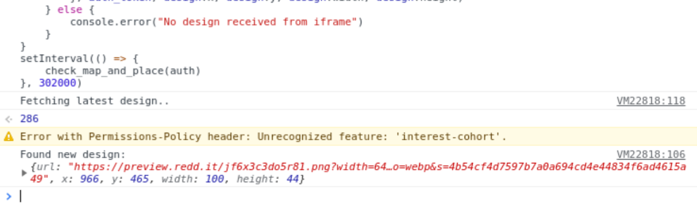

# Browser Place Bot (WIP)

NOTE: This is still in testing phase and does not work yet

* Launch your browser of choice with the following options from the command line:

```
Unix:
chrome --disable-web-security --user-data-dir="~/chrome"

Windows:
chrome --disable-web-security --user-data-dir="C:/chrome"

Note: Also works with brave
```

* Go to `https://www.reddit.com/r/place`
* Press `Ctrl-Shift-I`
* Go to `Network` tab and search for `query`



* Copy the `authorization` field (something like: `Bearer xxxxxxxx-xxxxxxxxxxxxxxxxxxxxxxxxxxxxxxxx`)
* Go to `Console` tab
* Type `auth = "<BEARER TOKEN>"` (replace `<BEARER TOKEN>` with what you found in the `Network` tab)
* Copy and paste [`COPYME.js`](COPYME.js) into the console
* Press Enter and it should look like this:




## Updating the bot

To update the bot, go here and edit the image link in the html:
https://github.com/zyansheep/placemonero